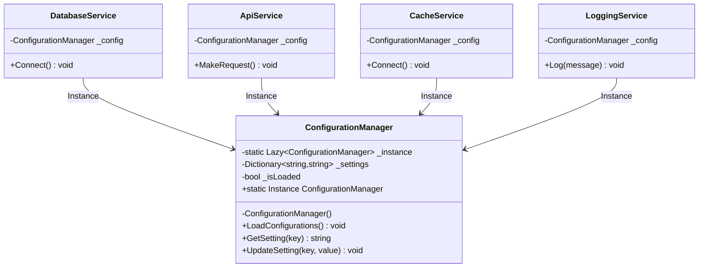

## 🥁 CarnaCode 2026 - Desafio 05 - Singleton

Oi, eu sou o Ronaldo e este é o espaço onde compartilho minha jornada de aprendizado durante o desafio **CarnaCode 2026**, realizado pelo [balta.io](https://balta.io). 👻

Aqui você vai encontrar projetos, exercícios e códigos que estou desenvolvendo durante o desafio. O objetivo é colocar a mão na massa, testar ideias e registrar minha evolução no mundo da tecnologia.

### Sobre este desafio
No desafio **Singleton** eu tive que resolver um problema real implementando o **Design Pattern** em questão.
Neste processo eu aprendi:
* ✅ Boas Práticas de Software
* ✅ Código Limpo
* ✅ SOLID
* ✅ Design Patterns (Padrões de Projeto)

## Problema
Uma aplicação precisa carregar configurações de banco de dados, APIs e cache uma única vez e compartilhar entre todos os componentes. O código atual permite múltiplas instâncias, causando inconsistências e desperdício de recursos.

## O Padrão Singleton

O **Singleton** é um padrão de projeto **criacional** que garante que uma classe tenha **apenas uma única instância** em toda a aplicação, fornecendo um **ponto de acesso global** a ela.

### Os 3 pilares do Singleton

| Pilar | Descrição | Implementação |
|---|---|---|
| **Construtor privado** | Impede a criação de instâncias externas via `new` | `private ConfigurationManager()` |
| **Instância estática** | Armazena a única instância da classe | `Lazy<ConfigurationManager>` |
| **Ponto de acesso global** | Propriedade que retorna sempre a mesma instância | `ConfigurationManager.Instance` |

### Por que usar `Lazy<T>`?

O `Lazy<T>` do .NET garante que a instância seja criada **apenas uma vez**, mesmo em cenários **multi-thread**, sem a necessidade de locks manuais.

```csharp
private static readonly Lazy<ConfigurationManager> _instance =
    new Lazy<ConfigurationManager>(() => new ConfigurationManager());

public static ConfigurationManager Instance => _instance.Value;
```

## Estrutura do Projeto

```
src/
├── Challenge.cs                  # Código original com os problemas
├── ConfigurationManager.cs       # Singleton - instância única
├── Program.cs                    # Entry point da solução
└── Services/
    ├── ApiService.cs             # Usa ConfigurationManager.Instance
    ├── CacheService.cs           # Usa ConfigurationManager.Instance
    ├── DatabaseService.cs        # Usa ConfigurationManager.Instance
    └── LoggingService.cs         # Usa ConfigurationManager.Instance
```

## Diagrama de Classes



## Processo de Refatoração

A refatoração foi realizada em **3 etapas iterativas**:

### Etapa 1 — Criar o Singleton
Criado `ConfigurationManager.cs` com construtor **privado**, campo `Lazy<T>` para thread-safety e propriedade `Instance` como ponto de acesso global.

### Etapa 2 — Criar os serviços
Cada serviço (`DatabaseService`, `ApiService`, `CacheService`, `LoggingService`) foi extraído para seu próprio arquivo em `src/Services/`, usando `ConfigurationManager.Instance` em vez de `new ConfigurationManager()`.

### Etapa 3 — Criar o Program.cs
Criado `Program.cs` como entry point da aplicação, demonstrando que todos os serviços compartilham a mesma instância e que as configurações permanecem **consistentes**.

### Antes vs Depois

| Aspecto | ❌ Antes | ✅ Depois |
|---|---|---|
| Instâncias criadas | 6+ (uma por serviço + no Main) | 1 (Singleton) |
| Carregamento de configurações | Repetido por instância | Uma única vez |
| Consistência | Cada instância com seus dados | Dados compartilhados |
| Thread-safety | Nenhum | Garantido via `Lazy<T>` |

## Sobre o CarnaCode 2026
O desafio **CarnaCode 2026** consiste em implementar todos os 23 padrões de projeto (Design Patterns) em cenários reais. Durante os 23 desafios desta jornada, os participantes são submetidos ao aprendizado e prática na idetinficação de códigos não escaláveis e na solução de problemas utilizando padrões de mercado.

### eBook - Fundamentos dos Design Patterns
Minha principal fonte de conhecimento durante o desafio foi o eBook gratuito [Fundamentos dos Design Patterns](https://lp.balta.io/ebook-fundamentos-design-patterns).

### Veja meu progresso no desafio
[Repositório Central](https://github.com/ronaldofas/balta-desafio-carnacode-2026-central)
